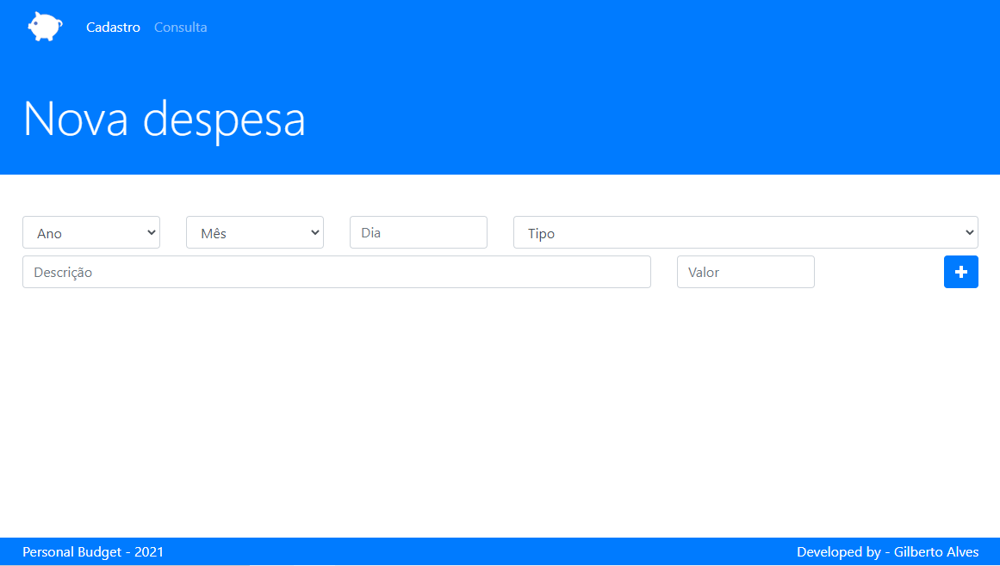

<h1 align="center">Personal budget</h1>
<h1 align="center"></h1>
<hr>

### 📚 Sobre

Personal Budget ou Orçamento Pessoal, é uma aplicação Web para gerenciar seu orçamento, como o nome diz.<br>
É uma aplicação que consiste cadastrar uma despesa, descrevendo ela com a data, tipo, descrição e valor, em seguida, o usuário pode fazer uma consulta de todas as despesas que foram cadastradas acessando a página Consulta.<br>
Na página consulta pode ser feita uma busca detalhada sobre determinada despesa. E também a remoção das mesmas.

### 🎨 Detalhes

Esta é uma aplicação que usa o armazenamento do browser localStorage, todos os dados(despesas) cadastradas ficam armazenadas lá. Logo, quando se remove uma despesa, automaticamente ela é removida do localStorage.

<hr>

### 🔥 Como contribuir

```
Fork este repositório
Faça suas mudanças
Envie um pull request
```

### 💻 Tecnologias utilizadas

Neste Aplicativo de Finanças foram utilizadas as seguintes tecnologias

- [HTML](https://www.w3schools.com/html/)
- [CSS](https://www.w3schools.com/css/)
- [JavaScript](https://www.w3schools.com/js/)
- [Bootstrap](https://getbootstrap.com/)

### ✈️ Como acessar o Personal budget

🚧🏗️👷‍♂️ ...Em construção... 👷‍♂️🏗️🚧


### 📃 Licença

Este projeto está sobre a licença <a href="https://github.com/GilbertoASJ/Personal-budget/blob/main/LICENSE">MIT</a>
